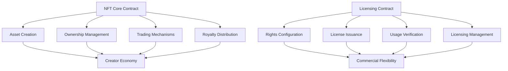

# Burn-Mesh: NFT Licensing Protocol

A decentralized NFT licensing and trading protocol enabling creators to mint, distribute, and monetize digital assets with flexible commercial rights on the Stacks blockchain.

## Overview

Burn-Mesh enables creators to:
- Mint unique NFTs with advanced licensing capabilities
- Configure flexible commercial rights
- Set dynamic pricing and royalty models
- Create scalable digital asset ecosystems

Collectors and users can:
- Acquire digital assets with precise usage rights
- Trade NFTs with attached licensing agreements
- Support creators through direct purchases
- Leverage tiered commercial access

## Architecture

The protocol consists of two interconnected smart contracts:



## Contract Documentation

### NFT Core (`nft-core.clar`)

The core contract manages fundamental NFT functionality:

- Asset creation and ownership tracking
- Advanced trading mechanics
- Royalty distribution systems
- Metadata management protocols

Key features:
- Configurable royalty percentages
- Platform fee mechanisms
- Metadata immutability
- Robust secondary market support

### Licensing (`nft-licensing.clar`)

Handles advanced licensing and usage rights:

- Multilevel licensing tiers
- Dynamic pricing strategies
- Comprehensive license verification
- Granular usage tracking

## Getting Started

### Prerequisites
- Clarinet
- Stacks wallet
- STX tokens for transactions

### Basic Usage

1. Creating a story:
```clarity
(contract-call? .nft-core create-asset "metadata-uri" u100)
```

2. Listing an asset for sale:
```clarity
(contract-call? .nft-core list-asset asset-id price)
```

3. Configuring a license:
```clarity
(contract-call? .nft-licensing configure-license-tier asset-id token-id tier price duration-days max-licenses)
```

## Function Reference

### Core Contract Functions

#### Asset Management
```clarity
(create-asset (metadata-uri (string-utf8 256)) (royalty-percentage uint))
(update-asset-metadata (asset-id uint) (new-metadata-uri (string-utf8 256)))
(freeze-asset-metadata (asset-id uint))
```

#### Trading
```clarity
(list-asset (asset-id uint) (price uint))
(buy-asset (asset-id uint))
(make-offer (asset-id uint) (offer-price uint) (expiry uint))
(accept-offer (asset-id uint) (offerer principal))
```

### Licensing Functions

#### License Management
```clarity
(configure-license-tier (asset-id uint) (token-id uint) (tier uint) (price uint) (duration-days uint) (max-licenses (optional uint)))
(purchase-license (asset-id uint) (token-id uint) (tier uint))
(renew-license (asset-id uint) (token-id uint) (tier uint))
(revoke-license (asset-id uint) (token-id uint) (tier uint) (licensee principal))
```

## Development

### Testing
Run tests using Clarinet:
```bash
clarinet test
```

### Local Development
1. Start local chain:
```bash
clarinet integrate
```

2. Deploy contracts:
```bash
clarinet deploy
```

## Security Considerations

### Core Contract
- Royalty calculations use basis points to avoid floating-point issues
- Ownership checks prevent unauthorized transfers
- Metadata freezing prevents post-sale modifications

### Licensing Contract
- License validation prevents unauthorized usage
- Expiration tracking ensures proper access control
- Creator-only license configuration and revocation
- Maximum license count enforcement

### General
- All financial transactions verify sufficient funds
- Access control checks on privileged operations
- State changes are atomic and consistent